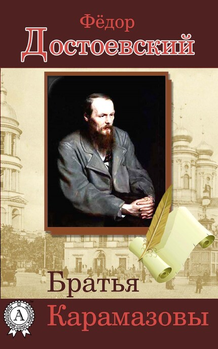

+++
title = 'Ф.М. Достоевский "Братья Карамазовы" | Книги & Литература'
date = 2023-11-20T12:00:11+01:00
draft = false

+++

В течение некоторого времени, я всё думала о том, что нужно бы почитать или заново перечитать русскую классическую литературу со школьной скамьи. Я начала это дело с "Братьев Карамазовых". 

Знаете что? Сестра моего мужа была полностью "за" идею прочтения этого произведения вместе со мной. Что-то вроде небольшого семейного книжного клуба. Мы решили прочитать эту книгу на двух разных языках - русском и турецком. Периодически, мы делились нашими мнениями и эмоциями. 

Итак, "Братья Карамазовы" развиваются на протяжении 12 книг (aka главами). Процесс чтения был довольно интересным и интригующим, а также давал пищу для размышлений. Я прочитала книгу в электронном формате, несмотря на то, что мне больше по душе физический переплет. 

Не то, что бы я была категорически против электронных книг — они, несомненно, более экологичны и доступны в любой момент в любое время. Тем не менее, есть что-то волшебное в физических книгах. Перелистывать страницу за страницей, вдыхать запах книги и наблюдать прогресс чтения воочию — это именно то, что мне очень ценно за чтением. 

Здесь и далее я указываю цитаты из книги, а также мои мысли по их поводу. 

"... Но, по-моему, чудеса реалиста никогда не смутят." p. 3

"В реалисте вера не от чуда рождается, а чудо от веры." p. 3

"... Жертва жизнию есть может быть самая легчайшая изо всех жертв." p. 3

"Старец это - берущий вашу душу, вашу волю в свою душу и в свою волю." p. 3

"Не стыдитесь столь самого себя, ибо от сего лишь все и выходит." p. 45

"Главное, самому себе не лгите." p. 46

"Лгущий себе самому прежде всех и обидеться может. Ведь обидеться иногда очень приятно, не так ли?" p. 46

"Иди же и не бойся. На людей не огорчайся, за обиды не сердись." p. 54

"Любовью все покупается, все спасается." p. 54

"Ибо для счастия созданы люди, и кто вполне счастлив, тот прямо удостоен сказать себе: "Я выполнил завет божий на сей земле". Все праведные, все святые, все святые мученики были все счастливы." p. 68

"Постарайтесь любить ваших ближних деятельно и неустанно. По мере того, как будете преуспевать в любви, будете убеждаться и в бытии бога, и в бессмертии души вашей. Если же дойдете до полного самоотвержения в любви к ближнему, тогда уж несомненно уверуете, и никакое сомнение даже и не возможет зайти в вашу душу." p. 59

"Чем больше я люблю человечество вообще, тем меньше я люблю людей в частности, то-есть порознь, как отдельных лиц." p. 60

"Сделайте, что можете, и сочтётся вам. У вас же много уже сделано, ибо вы могли столь глубоко и искренно сознать себя сами!" p. 60

"Главное, убегайте лжи, всякой лжи, лжи себе самой в особенности. Наблюдайте свою ложь и вглядывайтесь в нее каждый час, каждую минуту. Брезгливости убегайте тоже и к другим и к себе: то, что вам кажется внутри себя скверным, уже одним тем, что вы это заметили в себе, очищается. Страха тоже убегайте, хотя страх есть лишь последствие всякой лжи. Не пугайтесь никогда собственного вашего малодушия в достижении любви, даже дурных при этом поступков ваших не пугайтесь очень. Жалею, что не могу сказать вам ничего отраднее, ибо любовь деятельная сравнительно с мечтательною есть дело жестокое и устрашающее. Любовь мечтательная жаждет подвига скорого, быстро удовлетворимого и чтобы все на него глядели. Тут действительно доходит до того, что даже и жизнь отдают, только бы не продлилось долго, а поскорей совершилось, как бы на сцене, и чтобы все глядели и хвалили." p. 61

"Любовь же деятельная - это работа и выдержка, а для иных так пожалуй целая наука. Но предрекаю, что в ту даже самую минуту, когда вы будете с ужасом смотреть на то, что, несмотря на все ваши усилия, вы не только не подвинулись к цели, но даже как бы от нее удалились, — в ту самую минуту, предрекаю вам это, вы вдруг и достигнете цели и узрите ясно над собою чудодейственную силу господа, вас все время любившего и все время таинственно руководившего." p. 61

"Уничтожьте в человечестве веру в свое бессмертие, в нем тотчас же иссякнет не только любовь, но и всякая живая сила, чтобы продолжать мировую жизнь." p. 74

"В горе счастья ищи. Работай, неустанно работай." p. 82

"Поцелуй в губы и кинжал в сердце." p. 95

"Но влюбиться не значит любить. Влюбиться можно и ненавидя." p. 110

"Ужастно то, что красота есть не только страшная, но и таинственная вещь. Тут дьявол с богом борется, а поле битвы - сердца людей. А впрочем что у кого болит, тот о том и говорит." p. 114

"Кто ступил на нижнюю ступеньку, тот все равно непременно вступит и на верхнюю." p. 117

"... В России пьяные люди у нас самые добрые. Самые добрые люди у нас и самые пьяные." p. 217

"Знаю это твердо, все победит моя молодость, - всякое разочарование, всякое отвращение к жизни." p. 242

"...Я думаю, что все должны прежде всего на свете жизнь полюбить." p. 243

"Я убежден как младенец, что страдания заживут и сгладятся, что весь обидный комизм человеческих противоречий исчезнет как жалкий мираж, как гнусненькое измышление малосильного и маленького как атом человеческого эвклидовского ума, что наконец в мировом финале, в момент вечной гармонии, случится и явится нечто до того драгоценное, что хватит его на все сердца, на утоление всех негодований, на искупление всех злодейств людей, всей пролитой ими их крови, хватит, чтобы не только было возможно простить, но и оправдать все, что случилось с людьми." p. 248

"Глупость коротка и не хитра, а ум виляет и прячется. Ум подлец, а глупость пряма и честна." p. 248

"И если страдания детей пошли на пополнение той суммы страданий, которая необходима была для покупки истины, то я утверждаю заранее, что вся истина не стоит такой цены." p. 258

"Ибо тайна бытия человеческого не в том, чтобы только жить, а в том, для чего жить. Без твердого представления себе, для чего ему жить, человек не согласится жить и скорей истребит себя, чем останется на земле." p. 268

